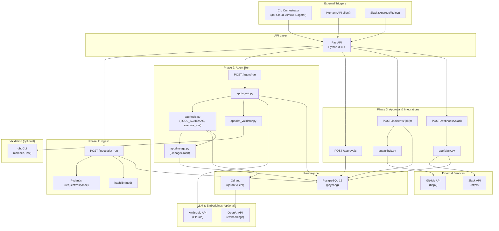
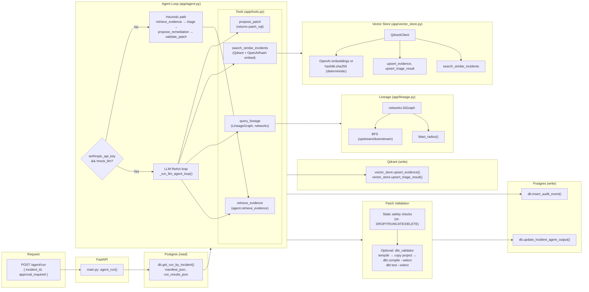
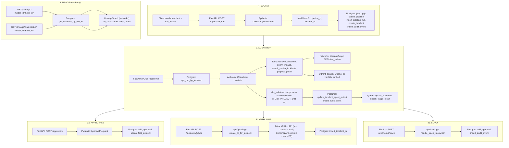
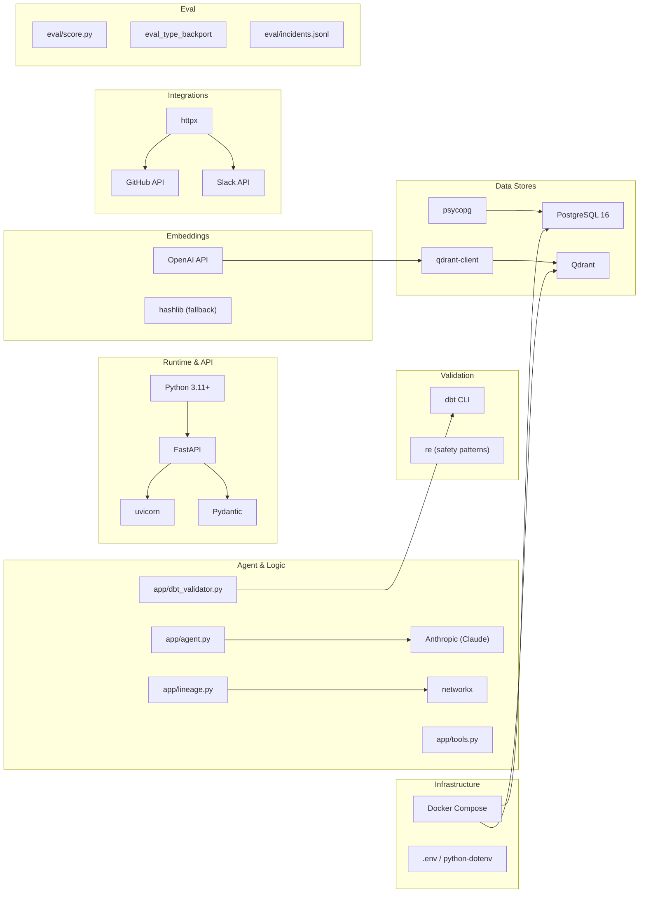

# Data Reliability Agent — System Flow Diagram

End-to-end flow with all tools and technologies. Diagrams use [Mermaid](https://mermaid.js.org/) (renders in GitHub, VS Code, and many Markdown viewers).

---

## How to view in Cursor (Mermaid + Markdown preview)

1. **Install a Mermaid preview extension**
   - Press **`Cmd+Shift+X`** (macOS) or **`Ctrl+Shift+X`** (Windows/Linux) to open the **Extensions** sidebar.
   - Search for **`Mermaid`**.
   - Install one of:
     - **Markdown Preview Mermaid Support** (e.g. by **Matt Bierner**), or  
     - **Mermaid Editor** (e.g. by **Tomoyuki Kimura**), or  
     - **Mermaid** (by **Mermaid**).
   - Reload the window if prompted.

2. **Open Markdown preview**
   - With `SYSTEM_FLOW_DIAGRAM.md` open, press **`Cmd+Shift+V`** (macOS) or **`Ctrl+Shift+V`** (Windows/Linux) for **Markdown: Open Preview**, or  
   - Press **`Cmd+K V`** / **`Ctrl+K V`** for **Markdown: Open Preview to the Side** (editor + preview side by side).

3. **Result**
   - The preview will render the Mermaid code blocks as diagrams. Use side-by-side view to scroll the doc and see each diagram.

*If diagrams don’t render, ensure the extension supports Mermaid in Markdown preview; “Markdown Preview Mermaid Support” is the usual choice.*

---

## 1. High-Level System Flow (All Phases)

---

## 2. Detailed Agent Loop (Tools & Technologies)

---

## 3. Data Flow & Technology per Step

---

## 4. Technology Stack Overview

---

## 5. Technology Legend (All Components)

| Technology | Where used | Purpose |
|------------|------------|---------|
| **Python 3.11+** | Entire app | Runtime |
| **FastAPI** | `app/main.py` | HTTP API, routes |
| **uvicorn** | Run command | ASGI server |
| **Pydantic** | `app/models.py`, request/response | Validation, serialization |
| **PostgreSQL 16** | `app/db.py`, Docker | Persistence (pipelines, runs, incidents, audit, approvals, PRs, notifications, traces) |
| **psycopg** | `app/db.py` | Postgres driver |
| **Qdrant** | `app/vector_store.py`, Docker | Vector store for evidence/triage similarity search |
| **qdrant-client** | `app/vector_store.py` | Qdrant Python client |
| **Anthropic (Claude)** | `app/agent.py` | LLM for ReAct agent loop (when not MOCK_LLM) |
| **OpenAI API** | `app/vector_store.py` | Embeddings (when OPENAI_API_KEY set) |
| **hashlib** | `app/vector_store.py`, `app/main.py` | Deterministic embeddings; pipeline_id, incident_id hashes |
| **networkx** | `app/lineage.py` | Directed graph, BFS for lineage/blast radius |
| **httpx** | `app/github.py`, `app/slack.py`, eval full mode | Async HTTP (GitHub, Slack, eval API calls) |
| **dbt CLI** | `app/dbt_validator.py` | `dbt compile`, `dbt test` in sandbox (when DBT_PROJECT_DIR set) |
| **re** | `app/agent.py` | Safety regex (DROP/TRUNCATE/DELETE) |
| **Docker Compose** | `docker-compose.yml` | Postgres 16, Qdrant services |
| **python-dotenv** | `app/config.py` | Load `.env` |
| **eval_type_backport** | `eval/score.py` | Eval harness dependency |
| **JSON** | Throughout | manifest, run_results, audit payloads |

---

*To view Mermaid diagrams in Cursor: see **How to view in Cursor** at the top of this file. Alternatively use GitHub, or [mermaid.live](https://mermaid.live).*
